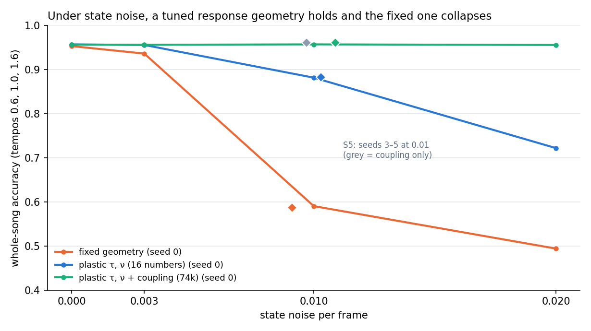

# ResonaattoriAivo

*Resonator brain.* A sequence memory whose resonators keep time in **beats, not frames**.
Teach it a melody at one tempo. Cue the opening at another tempo, and it recalls the rest at the new tempo.


## Where it came from

The repo grew out of a note (Sep 25 2026) about a "resonant brain". Each line of that note maps to one part of the code:

| the note | in the code |
|---|---|
| dendrites and axons create resonance windows; timing is geometry | `ResonatorBank`: damped complex modes per input channel with decay τ and frequency ν **in beats**. The lengths are the memory. |
| addressed with rhythmic time | `Clock`: a phase-locked loop seeded by a 4-click count-in, corrected by every onset. The resonators advance by the clock's **phase**, so "two beats ago" has the same state at any tempo. |
| layers hold frequencies, low to high | resonators from τ = 0.7 to 24 beats, plus two oscillating modes (phase-codes time since onset) |
| the initial layers set capability | a fixed random tanh layer ("pyramids", 512 units), never trained |
| basket / chandelier triggering the pyramids in order | basket = the clock's beat slots; chandelier = winner-take-all release of exactly one token per slot in free-run |
| a system that does the inverse of what is coming in | the readout learns only from the residue `r = onehot(actual) − p(expected)`. Surprisal of the residue is the novelty signal. |
| training is discussion: inner state → response → update | online, beat by beat: predict, hear, learn from the difference |
| old sequence → new sequence | tested as **junctions** (two songs share a middle segment and diverge after it). See the ledger: this part did not come out as expected. |

## Results

All gates were pre-registered in [`GATES.md`](GATES.md) and committed before the first run. The receipt is [`results/receipt.json`](results/receipt.json).

| gate | what | result |
|---|---|---|
| G0 | clock entrains over 0.6×–1.6× | **PASS** median phase error 0.031 beat, 0 slips |
| G1 | recall at training tempo | **PASS** 95.1 % (98.6 % of ceiling). *The GRU-32 comparison is vacuous; see ledger.* |
| G2 | tempo transfer, trained at 1.0× only | **PASS** mean 94.8 %, worst tempo −1.3 pts; clock frozen: −48 pts |
| G3 | accelerando 0.75→1.35 / ritardando | **PASS** 91.0 % / 93.5 % |
| G4 | slow bands carry context past a junction | **FAIL** RA 100 %, but RA without slow bands still gets 97 % (needed ≤ 60 %) |
| G5 | residue = surprise | **PASS** AUROC 1.00 novel vs familiar; substituted note localized 90 % |
| G6 | free-run: 12-beat cue, then its own clock | **PASS** 100 % at 1.0×, 97.3 % mean over tempos |

Accuracy by tempo (next-beat token, ceiling 96.4 %):

| model | trained on | 0.6× | 0.8× | 1.0× | 1.2× | 1.4× | 1.6× |
|---|---|---|---|---|---|---|---|
| **RA** (4.6k trained params) | 1.0× | 93.8 | 94.7 | 95.1 | 95.3 | 95.1 | 94.8 |
| RA, clock frozen | 1.0× | 18.0 | 43.8 | 95.8 | 55.2 | 32.6 | 22.3 |
| GRU-128 (55k params), *post hoc* | 1.0× | 10.4 | 19.9 | 96.5 | 25.4 | 18.6 | 18.6 |
| GRU-128 (55k params) | 0.7–1.4× | 85.9 | 96.7 | 96.5 | 96.4 | 96.6 | 91.9 |
| GRU-32 (4.4k params) | 0.7–1.4× | 30.1 | 44.5 | 46.9 | 44.3 | 41.1 | 34.4 |
| order-3 n-gram, handed the beat grid | – | 78.1 | 78.1 | 78.1 | 78.1 | 78.1 | 78.1 |

**What this shows.** A capable GRU trained at one tempo knows that tempo only. Moving 10 % off drops it to 38–50 %. To reach RA's flat curve, it needs 12× the parameters **and** training at every tempo, and it still slips outside the range it was trained on (85.9 % at 0.6×). RA learns at one tempo and is flat from 0.6× to 1.6×. The frozen-clock ablation shows this comes from the clock. The resonators alone do not provide it.

## Stage 2: the residue reshapes the geometry

Stage 1 is "the brain starts with geometry": fixed resonators, a fixed random pyramid layer, and only the readout learns. Stage 2 lets the prediction error reshape what the system is susceptible to. Two things can change: each resonator's decay τ and frequency ν (**16 numbers**), and the coupling that mixes modes into the pyramids (**74k numbers**). The gates are in [`GATES_STAGE2.md`](GATES_STAGE2.md) and were committed before the runs. Receipts: [`results/receipt_stage2.json`](results/receipt_stage2.json), [`results/receipt_stage2_s5.json`](results/receipt_stage2_s5.json).

"The residue reshapes it" means backprop of the prediction error into τ, ν and the coupling. At the output, that gradient is exactly the residue onehot − p. It is not a local, brain-like plasticity rule.



| gate | what | result |
|---|---|---|
| S1 | at noise 0.003, plastic τ/ν ≥ fixed + 10 pts | **FAIL** 95.9 vs 94.8 %. The fixed arm was already fine at this noise; the pilot had shown this before the run (see ledger). |
| S2 | tempo transfer survives plastic geometry | **PASS** worst tempo −0.7 pts |
| S3 | 18-beat junction, plastic ≥ fixed + 15 pts | **FAIL** 100 vs 93.5 %. Better on every seed, but short of +15. |
| S5a | noise 0.01, fresh seeds: plastic τ/ν ≥ fixed + 15 pts, every seed | **PASS** 88.3 vs 58.7 % (seeds 82 / 92 / 90 vs 61 / 58 / 57) |
| S5b | geometry adds on top of trainable coupling (+5 pts) | **FAIL** 96.1 vs 96.1 % |

Noise 0.01, three fresh seeds, tempos 0.6 / 1.0 / 1.6:

| arm | trainable beyond readout | whole song | after the 18-beat junction |
|---|---|---|---|
| fixed | nothing | 58.7 % | 59.4 % |
| plastic τ, ν | 16 numbers | 88.3 % | 97.2 % |
| coupling only | 74k numbers | 96.1 % | 100 % |
| plastic τ, ν + coupling | 74k + 16 | 96.1 % | 99.8 % |

**What this shows.**
- A fixed random response geometry collapses under state noise. Letting the residue retune it rescues the memory. The rescue is large (+30 points) and holds on every seed.
- The *which part* result is the honest limit. Retuning 16 resonator numbers recovers about 80 % of the gap. Retuning the mode-to-pyramid coupling recovers all of it, and once the coupling is plastic, the resonator geometry adds nothing measurable. "Plasticity of the response geometry" is supported. "It has to be the resonance frequencies" is not: in this model the susceptibility can live in the resonators or in how they are combined.
- Per number, the resonator geometry is by far the most efficient: 16 numbers for +30 points.
- **What the geometry learned** (noise 0.003, all 3 seeds agree): the fastest mode slows down (τ 0.7 → 1.0–1.6 beats), and both oscillating modes lengthen their decay (3 → 4.4–4.8 and 8 → 10–12 beats). The oscillating modes keep their frequencies (ν ≈ 0.25 and 0.12 cycles/beat). The pure-decay modes pick up small rotations (|ν| up to 0.1).
- **Correction to Stage 1.** Stage 1's drop to 73–78 % at noise 0.003 was mostly its training (delta rule, feature scaling), not the fixed geometry. With a better-conditioned readout, fixed geometry holds 94.8 % at that noise. The fragility is real, but it starts at higher noise (0.01).

## Stage 3: two modules that share only events

Motivated by Martin-Burgos et al. (bioRxiv 2026.09.15.751814: spike waveforms vary with input and network state) and by analog-digital facilitation (a neuron's state reaches only synapses within ~150–700 µm of axon). The question: when two systems share only events, can a small state-dependent **shape** on each event carry history the receiver cannot hold itself? Gates: [`GATES_STAGE3.md`](GATES_STAGE3.md), committed before the run. Receipt: [`results/receipt_stage3.json`](results/receipt_stage3.json).

- **The sender** hears the melody with long memory (τ up to 24 beats). It fires at every onset, keeping timing and identity, plus a 3-number shape from a trainable head.
- **The receiver** has only short memory (τ < 6 beats) and hears only the events.
- **The task** sits behind an 18-beat shared segment, so only the old history says which song it is.
- **Setup:** noise 0.006, trained at tempo 1.0, tested at 0.6 / 1.0 / 1.6, 3 seeds.
- **The shape** is an abstract descriptor, not a simulated voltage trace.

| arm | after the segment | whole song |
|---|---|---|
| timestamps + identity only | 65.7 % | 73.3 % |
| shape from identity only | 59.4 % | 72.5 % |
| **shape from sender state** | **71.5 %** | **83.4 %** |
| shape from sender state, attenuated e⁻⁴ | 49.5 % | 58.2 % |
| receiver with its own long memory, no shape | 74.7 % | 82.7 % |
| receiver with its own long memory + shape | 82.7 % | 88.7 % |
| *post hoc:* sender with **short** memory only | 71.3 % | 82.9 % |

| gate | result |
|---|---|
| T1 shape carries history (+15 pts after the segment) | **FAIL** +5.8 pts |
| T2 clamp / shuffle the shapes lose ≥ 15 pts | **PASS** 28.9 % / 26.7 %, below the no-shape baseline |
| T3 transplanting the sender's history redirects the continuation | **FAIL** 2 of 6 eligible cases (only 6 cases qualified) |
| T4 at 4 length constants the benefit is gone | **PASS** but the attenuated, noisy channel actively hurts |
| T5 (my prediction) a receiver with its own memory gains < 3 pts | **FAIL** +8.0 pts |

**What this shows.**
- **State-dependent events help, and the receiver comes to depend on them.** Whole-song accuracy rises by 10 points. Clamping or shuffling the shapes drops the receiver below where it would be with no shapes at all.
- **The shapes do not carry old history.**
  - A sender with no more memory than the receiver gives the same gain (post-hoc control).
  - Transplanting the sender's history does not redirect the continuation.
  - What the shape carries is a cleaner, trained summary of recent context. The sender works as a second processing stage.
  - This is the reading Sol flagged as the less interesting one ("extra analog bandwidth"). Here it is the right one.
- **Distance works in one direction only.** Beyond the length constant the benefit disappears, as the geometry says. A receiver tuned to listen to that channel then pays for listening to noise.
- **My T5 prediction was wrong in its number and right in its reason.** A receiver with its own long memory still gained 8 points, but from the extra processing stage, not from missing history.
- **Biology.** This does not test real spikes. It shows that in a small learned system, the useful content of a state-dependent spike was the sender's processing, not its memory.

## Ledger: what did not work, and what is not new

- **G4 failed.** A 6-beat shared segment is not long enough to need the slow bands. The post-hoc sweep (`posthoc.py`) makes the segment 12 and 18 beats long. Without slow bands the model then drops to 82–84 %, while full RA stays at 100 %. So the slow bands help noise-free.
- **The model is fragile under state noise, and the slow bands do not help there** (`posthoc_noise.py`, post hoc). Small noise was added to the resonator state (0.003 per frame). RA's whole-song accuracy fell from about 95 % to 73–78 %. Without the slow bands it fell less, to 83–84 %. At junctions, RA-noslow then matched or slightly beat RA. Noise accumulates most in the slow modes, which cancels their advantage. **The context-by-slow-bands story is not supported yet.** *(A first run of this test was invalid. The ν = 0 modes have imaginary parts that are exactly zero in training, and feature standardization amplified the noise on them by 10⁶. The rerun uses a 0.05 floor on the standard deviation.)*
- **The parameter-matched GRUs failed to train.** They reach 43–47 % even at the training tempo. So "RA beats GRU-aug" in the receipt, and the GRU half of G1, compare against a broken baseline. The real comparison is GRU-128, shown above. A GRU-32 with better training might do much better.
- **The world is easy and clean.** It has 12 songs, 8 pitches, ±10 ms jitter, a count-in, and no missed onsets or ornaments. The clock gets a clean tempo from the count-in. Octave errors (locking at half or double tempo) were not tested without the count-in.
- **None of the parts is new.** Oscillator entrainment to rhythm: Large & Kolen 1994. Resonator-bank beat tracking: Scheirer 1998. Scale-free leaky or Laplace time memories: Howard & Shankar's time cells, and Voelker's Legendre Memory Unit (2019). Fixed random layer with a trained readout: echo-state networks. RNNs that learn time-warp invariance through gating: Tallec & Ollivier 2018. Theta–gamma slot coding: Lisman & Jensen 2013. What is specific here is the assembly: a clock-slaved resonator memory with a residue-trained readout and slot-wise release. The measured point is that it transfers across tempos from **one** training tempo, where a GRU needs augmentation.
- The demo learns with recursive least squares on the residue (one listen is enough). The gates use the plain delta rule.

## Run it

```
pip install numpy torch matplotlib
python run_gates.py        # ~20 min on 2 CPU cores (GRU training dominates)
python posthoc.py          # GRU-128 at one tempo + junction length sweep
python posthoc_noise.py    # state-noise test
python make_figure.py
python run_stage2.py       # Stage 2 gates S1-S3 + noise sweep (~40 min)
python run_stage2_s5.py    # S5 confirmation at noise 0.01 (~20 min)
python make_figure_stage2.py
PYTHONPATH=. python run_stage3.py        # Stage 3 gates T1-T5 (~35 min)
PYTHONPATH=. python posthoc_stage3.py    # short-memory sender control
```
Open `demo/index.html` in a browser for the instrument. Teach it Ukko Nooa, change the tempo, then press Cue & continue.

After the sd-floor option was added, RA reproduces the receipt within 0.6 points. The receipt itself comes from the commit that precedes the post-hoc work.

## Layout

```
GATES.md            pre-registered gates + ledger of changes
ra/world.py         junction-paired songs, frame renderer, prefix-oracle ceiling
ra/model.py         Clock, ResonatorBank, ResonaattoriAivo (fit / predict / free_run)
ra/baselines.py     GRU on frames, beat-grid n-gram
run_gates.py        G0–G6 → results/receipt.json
posthoc*.py         follow-ups written after the receipt
GATES_STAGE2.md     Stage 2 gates (plastic geometry) + ledger
ra/plastic.py       torch resonators whose tau, nu and coupling the residue can reshape
run_stage2*.py      Stage 2 runners
GATES_STAGE3.md     Stage 3 gates (two modules, events only) + ledger
ra/twomodule.py     sender/receiver modules, state-dependent event shapes, attacks
run_stage3.py       Stage 3 runner
demo/index.html     browser instrument (same model, RLS readout)
```
