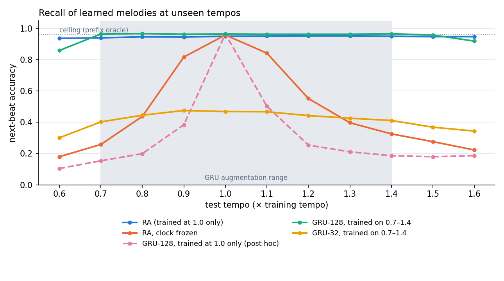

# ResonaattoriAivo

*Resonator brain.* A sequence memory whose resonators keep time in **beats, not frames**.
Teach it a melody at one tempo. Cue the opening at another tempo, and it recalls the rest at the new tempo.



## Where it came from

The repo grew out of a note (Sep 25 2026) about a "resonant brain". Each line of that note maps to one part of the code:

| the note | in the code |
|---|---|
| dendrites and axons create resonance windows; timing is geometry | `ResonatorBank`: damped complex modes per input channel with decay τ and frequency ν **in beats**. The lengths are the memory. |
| addressed with rhythmic time | `Clock`: a phase-locked loop seeded by a 4-click count-in, corrected by every onset. The resonators advance by the clock's **phase**, so "two beats ago" has the same state at any tempo. |
| layers hold frequencies, low to high | resonators from τ = 0.7 to 24 beats, plus two oscillating modes (phase-codes time since onset) |
| the initial layers set capability | a fixed random tanh layer ("pyramids", 512 units), never trained |
| basket / chandelier triggering the pyramids in order | basket = the clock's beat slots; chandelier = winner-take-all release of exactly one token per slot in free-run |
| a system that does the inverse of what is coming in | the readout learns only from the residue `r = onehot(actual) − p(expected)`. Surprisal of the residue is the novelty signal. |
| training is discussion: inner state → response → update | online, beat by beat: predict, hear, learn from the difference |
| old sequence → new sequence | tested as **junctions** (two songs share a middle segment and diverge after it). See the ledger: this part did not come out as expected. |

## Results

All gates were pre-registered in [`GATES.md`](GATES.md) and committed before the first run. The receipt is [`results/receipt.json`](results/receipt.json).

| gate | what | result |
|---|---|---|
| G0 | clock entrains over 0.6×–1.6× | **PASS** median phase error 0.031 beat, 0 slips |
| G1 | recall at training tempo | **PASS** 95.1 % (98.6 % of ceiling). *The GRU-32 comparison is vacuous; see ledger.* |
| G2 | tempo transfer, trained at 1.0× only | **PASS** mean 94.8 %, worst tempo −1.3 pts; clock frozen: −48 pts |
| G3 | accelerando 0.75→1.35 / ritardando | **PASS** 91.0 % / 93.5 % |
| G4 | slow bands carry context past a junction | **FAIL** RA 100 %, but RA without slow bands still gets 97 % (needed ≤ 60 %) |
| G5 | residue = surprise | **PASS** AUROC 1.00 novel vs familiar; substituted note localized 90 % |
| G6 | free-run: 12-beat cue, then its own clock | **PASS** 100 % at 1.0×, 97.3 % mean over tempos |

Accuracy by tempo (next-beat token, ceiling 96.4 %):

| model | trained on | 0.6× | 0.8× | 1.0× | 1.2× | 1.4× | 1.6× |
|---|---|---|---|---|---|---|---|
| **RA** (4.6k trained params) | 1.0× | 93.8 | 94.7 | 95.1 | 95.3 | 95.1 | 94.8 |
| RA, clock frozen | 1.0× | 18.0 | 43.8 | 95.8 | 55.2 | 32.6 | 22.3 |
| GRU-128 (55k params), *post hoc* | 1.0× | 10.4 | 19.9 | 96.5 | 25.4 | 18.6 | 18.6 |
| GRU-128 (55k params) | 0.7–1.4× | 85.9 | 96.7 | 96.5 | 96.4 | 96.6 | 91.9 |
| GRU-32 (4.4k params) | 0.7–1.4× | 30.1 | 44.5 | 46.9 | 44.3 | 41.1 | 34.4 |
| order-3 n-gram, handed the beat grid | – | 78.1 | 78.1 | 78.1 | 78.1 | 78.1 | 78.1 |

**What this shows.** A capable GRU trained at one tempo knows that tempo only. Moving 10 % off drops it to 38–50 %. To reach RA's flat curve, it needs 12× the parameters **and** training at every tempo, and it still slips outside the range it was trained on (85.9 % at 0.6×). RA learns at one tempo and is flat from 0.6× to 1.6×. The frozen-clock ablation shows this comes from the clock. The resonators alone do not provide it.

## Ledger: what did not work, and what is not new

- **G4 failed.** A 6-beat shared segment is not long enough to need the slow bands. The post-hoc sweep (`posthoc.py`) makes the segment 12 and 18 beats long. Without slow bands the model then drops to 82–84 %, while full RA stays at 100 %. So the slow bands help noise-free.
- **The model is fragile under state noise, and the slow bands do not help there** (`posthoc_noise.py`, post hoc). Small noise was added to the resonator state (0.003 per frame). RA's whole-song accuracy fell from about 95 % to 73–78 %. Without the slow bands it fell less, to 83–84 %. At junctions, RA-noslow then matched or slightly beat RA. Noise accumulates most in the slow modes, which cancels their advantage. **The context-by-slow-bands story is not supported yet.** *(A first run of this test was invalid. The ν = 0 modes have imaginary parts that are exactly zero in training, and feature standardization amplified the noise on them by 10⁶. The rerun uses a 0.05 floor on the standard deviation.)*
- **The parameter-matched GRUs failed to train.** They reach 43–47 % even at the training tempo. So "RA beats GRU-aug" in the receipt, and the GRU half of G1, compare against a broken baseline. The real comparison is GRU-128, shown above. A GRU-32 with better training might do much better.
- **The world is easy and clean.** It has 12 songs, 8 pitches, ±10 ms jitter, a count-in, and no missed onsets or ornaments. The clock gets a clean tempo from the count-in. Octave errors (locking at half or double tempo) were not tested without the count-in.
- **None of the parts is new.** Oscillator entrainment to rhythm: Large & Kolen 1994. Resonator-bank beat tracking: Scheirer 1998. Scale-free leaky or Laplace time memories: Howard & Shankar's time cells, and Voelker's Legendre Memory Unit (2019). Fixed random layer with a trained readout: echo-state networks. RNNs that learn time-warp invariance through gating: Tallec & Ollivier 2018. Theta–gamma slot coding: Lisman & Jensen 2013. What is specific here is the assembly: a clock-slaved resonator memory with a residue-trained readout and slot-wise release. The measured point is that it transfers across tempos from **one** training tempo, where a GRU needs augmentation.
- The demo learns with recursive least squares on the residue (one listen is enough). The gates use the plain delta rule.

## Run it

```
pip install numpy torch matplotlib
python run_gates.py        # ~20 min on 2 CPU cores (GRU training dominates)
python posthoc.py          # GRU-128 at one tempo + junction length sweep
python posthoc_noise.py    # state-noise test
python make_figure.py
```
Open [Check out the live demo!](https://anttiluode.github.io/ResonaattoriAivo/demo/index.html) in a browser for the instrument. Teach it Ukko Nooa, change the tempo, then press Cue & continue.

After the sd-floor option was added, RA reproduces the receipt within 0.6 points. The receipt itself comes from the commit that precedes the post-hoc work.

## Layout

```
GATES.md            pre-registered gates + ledger of changes
ra/world.py         junction-paired songs, frame renderer, prefix-oracle ceiling
ra/model.py         Clock, ResonatorBank, ResonaattoriAivo (fit / predict / free_run)
ra/baselines.py     GRU on frames, beat-grid n-gram
run_gates.py        G0–G6 → results/receipt.json
posthoc*.py         follow-ups written after the receipt
demo/index.html     browser instrument (same model, RLS readout)
```
